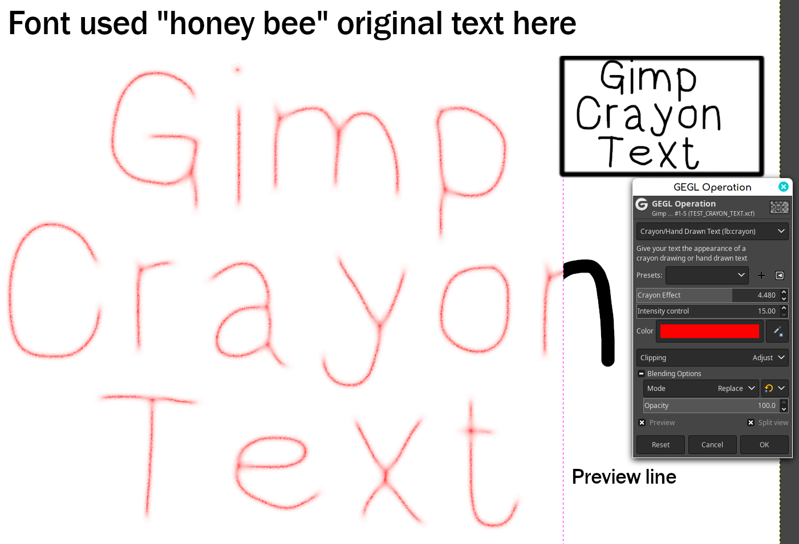
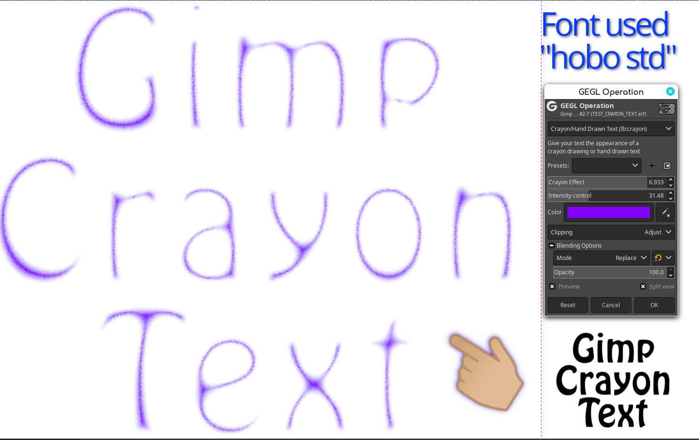
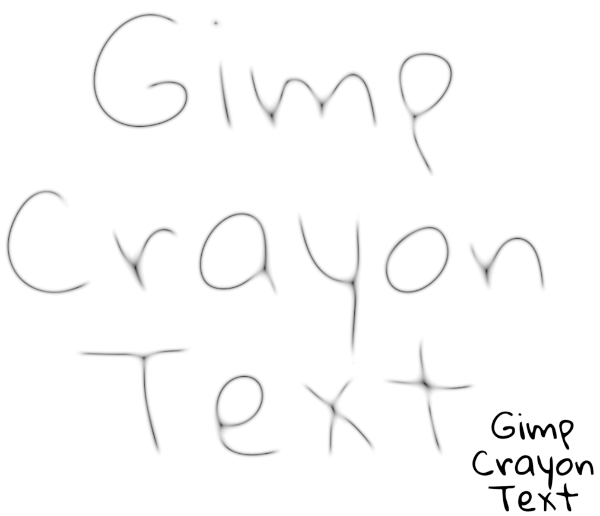

For binary downloads for Windows and Linux please go to the "releases" section

## Crayon Text plugin for Gimp

Give your text the appearance of a crayon drawing or hand drawn text with this plugin.
Try using a semi bond font that resemble human hand drawings with this for the most
interesting results. This plugin probably won't work at all with very thin fonts.





## Location to put Binaries 
They don't go in the normal plugins directory.

### Windows
 C:\Users\(USERNAME)\AppData\Local\gegl-0.4\plug-ins
 
### Linux 
 /home/(USERNAME)/.local/share/gegl-0.4/plug-ins
 
### Linux (Flatpak includes Chromebook)
 /home/(USERNAME)/.var/app/org.gimp.GIMP/data/gegl-0.4/plug-ins


## Compiling and Installing

### Linux

To compile and install you will need the GEGL header files (`libgegl-dev` on
Debian based distributions or `gegl` on Arch Linux) and meson (`meson` on
most distributions).

```bash
meson setup --buildtype=release build
ninja -C build

```

### Windows

The easiest way to compile this project on Windows is by using msys2.  Download
and install it from here: https://www.msys2.org/

Open a msys2 terminal with `C:\msys64\mingw64.exe`.  Run the following to
install required build dependencies:

```bash
pacman --noconfirm -S base-devel mingw-w64-x86_64-toolchain mingw-w64-x86_64-meson mingw-w64-x86_64-gegl
```

Then build the same way you would on Linux:

```bash
meson setup --buildtype=release build
ninja -C build
```

## Another preview of this plugin making non crayon hand drawn text



